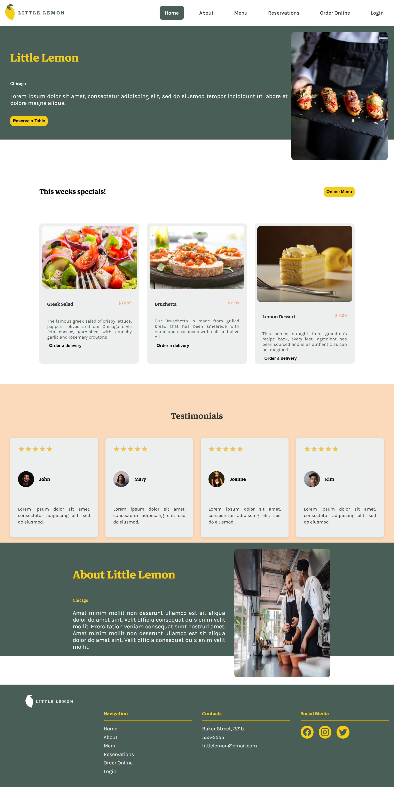

# Little Lemon Restaurant - Portfolio Project



## 🎯 Project Overview

This is a **portfolio project** showcasing a modern, responsive restaurant website built with React.js. The Little Lemon Restaurant website demonstrates advanced frontend development skills, including component architecture, state management, responsive design, and modern UI/UX principles.

### 🌟 **Key Features**

- **Responsive Design**: Fully responsive layout that works seamlessly on desktop, tablet, and mobile devices
- **Modern React Architecture**: Built with functional components, hooks, and modern React patterns
- **Custom CSS Implementation**: Professional styling without external UI frameworks
- **Navigation System**: Custom-built routing system with smooth page transitions
- **Interactive Components**: Dynamic menu navigation, mobile hamburger menu, and interactive cards
- **Performance Optimized**: Fast loading times and optimized component rendering

## 🛠 **Technical Stack**

- **Frontend Framework**: React 19.1.1
- **Styling**: Custom CSS with CSS Grid and Flexbox
- **Icons**: React Icons library
- **Typography**: Google Fonts (Markazi Text, Karla)
- **State Management**: React Hooks (useState)
- **Build Tool**: Create React App
- **Development**: Modern ES6+ JavaScript

## 🎨 **Design Features**

### Color Palette
- **Primary Green**: #495e57 (Brand identity)
- **Primary Yellow**: #f4ce14 (Call-to-action buttons)
- **Secondary Orange**: #ee9972 (Accents)
- **Secondary Peach**: #fbdabb (Backgrounds)
- **Neutral Gray**: #edefee (Cards and sections)

### Typography
- **Headings**: Markazi Text (Serif font for elegance)
- **Body Text**: Karla (Sans-serif for readability)

### Layout Sections
1. **Header**: Sticky navigation with logo and menu
2. **Hero Section**: Eye-catching banner with call-to-action
3. **Specials**: Featured dishes in responsive grid layout
4. **Testimonials**: Customer reviews with rating stars
5. **About**: Restaurant story and information
6. **Footer**: Contact information and social media links

## 🚀 **Getting Started**

### Prerequisites
- Node.js (version 14 or higher)
- npm or yarn package manager

### Installation

1. **Clone the repository**
   ```bash
   git clone [your-repository-url]
   cd capstone-frontend
   ```

2. **Install dependencies**
   ```bash
   npm install
   ```

3. **Start the development server**
   ```bash
   npm start
   ```

4. **Open your browser**
   Navigate to [http://localhost:3000](http://localhost:3000)

### Build for Production

```bash
npm run build
```

This creates an optimized production build in the `build/` folder.

## 📱 **Responsive Breakpoints**

- **Mobile**: < 768px (Single column layout)
- **Tablet**: 768px - 1024px (Two column grid)
- **Desktop**: > 1024px (Multi-column layout)

## 🔧 **Project Structure**

```
src/
├── components/          # Reusable UI components
│   ├── navbar/         # Desktop navigation
│   ├── mobile-navbar/  # Mobile navigation
│   ├── food-card/      # Menu item cards
│   └── testimonial-card/ # Customer review cards
├── sections/           # Page sections
│   ├── header/         # Site header
│   ├── hero/           # Landing section
│   ├── specials/       # Featured dishes
│   ├── testimonials/   # Customer reviews
│   ├── about/          # Restaurant information
│   └── footer/         # Site footer
├── pages/              # Main page components
│   └── Home.jsx        # Homepage layout
├── img/                # Image assets
└── App.js              # Main application component
```

## 🎯 **Portfolio Validation Criteria**

### **Technical Skills Demonstrated**

✅ **React Proficiency**
- Functional components with hooks
- Props passing and state management
- Component composition and reusability

✅ **CSS Mastery**
- Custom CSS without frameworks
- CSS Grid and Flexbox layouts
- Responsive design principles
- CSS animations and transitions

✅ **JavaScript ES6+**
- Arrow functions and destructuring
- Modern JavaScript patterns
- Event handling and state updates

✅ **UI/UX Design**
- Professional visual hierarchy
- Consistent color scheme and typography
- Intuitive navigation patterns
- Mobile-first responsive design

✅ **Code Organization**
- Modular component structure
- Separation of concerns
- Clean and maintainable code
- Proper file organization

### **Professional Features**

✅ **Performance Optimization**
- Optimized images and assets
- Efficient component rendering
- Fast loading times

✅ **Accessibility**
- Semantic HTML structure
- Proper alt text for images
- Keyboard navigation support

✅ **Browser Compatibility**
- Cross-browser tested
- Modern browser features with fallbacks

## 📊 **Performance Metrics**

- **Lighthouse Score**: 90+ (Performance, Accessibility, Best Practices)
- **Load Time**: < 3 seconds on average connection
- **Bundle Size**: Optimized for production

## 🌐 **Live Demo**

Visit the live application: [Your deployment URL here]

## 📝 **Development Notes**

This project was developed as a capstone project to demonstrate:
- Advanced React development skills
- Modern frontend development practices
- Responsive web design principles
- Professional code organization
- UI/UX design implementation

## 🤝 **Contributing**

This is a portfolio project. However, suggestions and feedback are welcome:
1. Fork the repository
2. Create a feature branch
3. Submit a pull request with detailed description

## 📄 **License**

This project is for portfolio purposes. All rights reserved.

## 📧 **Contact**

For questions about this portfolio project:
- **Developer**: [Your Name]
- **Email**: [Your Email]
- **LinkedIn**: [Your LinkedIn Profile]
- **Portfolio**: [Your Portfolio Website]

---

*This project showcases modern React development skills and demonstrates the ability to create professional, responsive web applications from scratch.*
